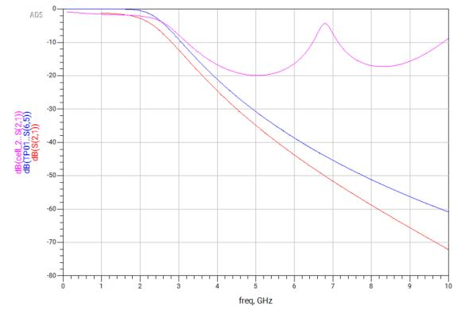
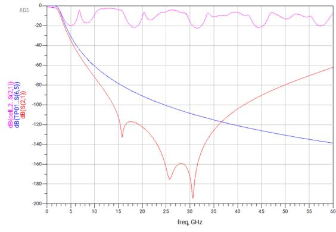
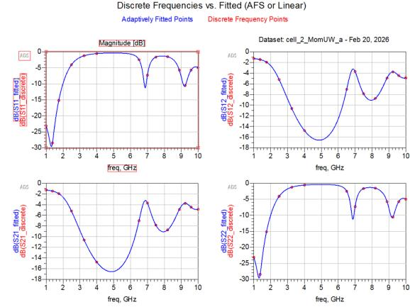

# 01 · Low-pass filter: microstrip vs GaAs MMIC

**Spec:** 5th-order Butterworth low-pass for 2.4 GHz Wi-Fi. fc = 2.462 GHz, ≥ 47 dB rejection at 3·fc, symmetric π topology, 50 Ω.

**Built two ways** on the UMS PH25-20 GaAs process (εr = 12.8, h = 70 µm): a distributed version (stepped-impedance microstrip) and a lumped version (MMIC spiral inductors + MIM capacitors).

**Tools:** Keysight ADS (schematic, LineCalc, gradient optimiser, Momentum 2.5D MoM), UMS PH25-20 PDK.

## Results

| | Ideal LC | Microstrip | MMIC |
|---|---|---|---|
| Filter length | — | ≈ 23 mm | **≈ 1.5 mm** (15× shorter) |
| Rejection at 3·fc (7.4 GHz) | 47.7 dB | ≈ 12 dB ✗ | **≈ 52 dB** ✓ |
| Spurious passbands | none | from 6.8 GHz (−4 dB) | none up to 60 GHz (≈ −62 dB at 60 GHz) |

*S21 from 0 to 10 GHz. Blue: ideal LC. Pink: microstrip. Red: MMIC.*

*Same comparison up to 60 GHz, the upper limit of the process. The microstrip version shows repeating spurious passbands. The MMIC version stays below −60 dB from about 8 GHz to 60 GHz, ending near −62 dB at 60 GHz where it rises again. The transmission-zero depths (down to −195 dB) are simulator values: a real chip or instrument would hit a floor near −100 dB.*

## What I did

1. **Ideal synthesis:** simulated the π and T versions and ADS's built-in Butterworth model. All three curves overlap: −3.1 dB at 2.47 GHz.
2. **Microstrip:** used 25 Ω lines for the capacitors and 90 Ω lines for the inductors. Synthesised them in LineCalc and compared with the Hammerstad–Jensen closed-form results. Ran the circuit simulation with and without losses, then gradient-optimised the line lengths to put fc back at 2.46 GHz.
3. **EM check:** ran Momentum (method of moments) on the layout after a mesh study (cells/λ 20 vs 40, edge mesh on/off, 0/4/6 cells across the width). Kept 40 cells/λ, edge mesh on and 6 cells across the width.
4. **MMIC:** built the filter from PDK spiral inductors, 250 pF/mm² MIM capacitors and via-holes. Redrew the auto-generated layout by hand (MLIN lines + tee junctions), optimised the L/C values, and added GSG 50 Ω probe pads for on-wafer measurement.

*Momentum EM S-parameters of the microstrip filter (fitted curve vs discrete points). EM and circuit simulations both put the first spurious passband near 6.8–6.9 GHz.*

## Takeaways

- **Stepped-impedance lines only act like L and C while they are electrically short.** The 6.33 mm central 25 Ω section gets close to λ/2 around 6.8 GHz and stops blocking the signal. That's why the microstrip version fails the 3·fc spec, even after optimisation.
- **The MMIC trades loss for size.** It is 15× shorter and its stopband stays clean, but S21 at fc is −6.1 dB instead of −3 dB. Optimising the L/C values only moved it from −6.8 to −6.1 dB. The extra ~3 dB comes from inductor loss (finite spiral Q), which tuning the values can't fix.
- **Parasitics set the upper limit.** The MMIC stopband has transmission zeros at ≈ 16, 26 and 31 GHz, then rejection weakens towards 60 GHz. This comes from spiral inter-winding capacitance and via inductance.
- **EM simulation catches what circuit models miss.** Momentum predicts a shallower stopband than the circuit model (−16.5 dB vs −20 dB minimum), because it includes coupling and discontinuities.

MMIC layouts are not shown because the UMS PH25-20 PDK is licensed.
