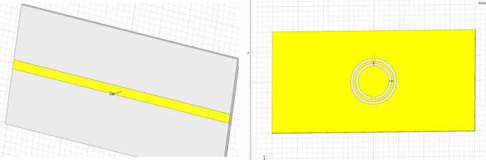
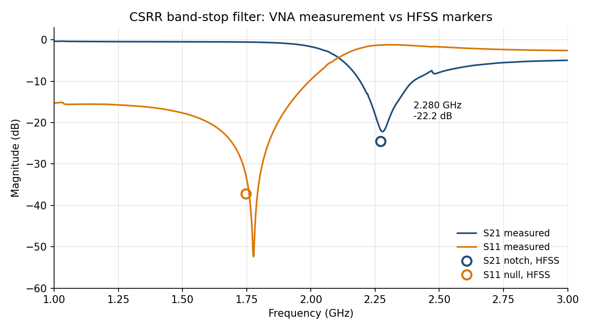
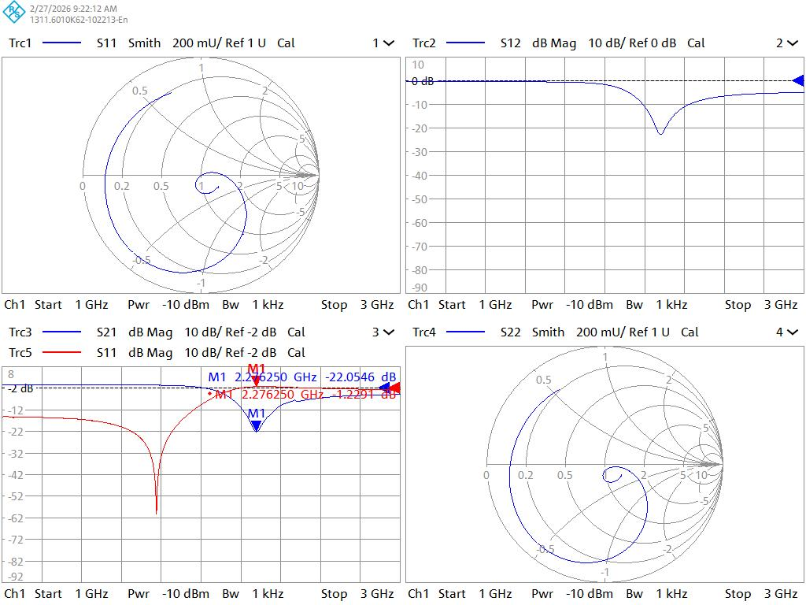
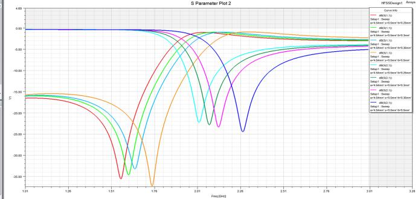

# 02 · CSRR band-stop filter: HFSS vs VNA measurement

**Device:** a 50 Ω microstrip line on FR4 with a complementary split-ring resonator (CSRR) etched into the ground plane. This metamaterial cell gives a band-stop response near 2.3 GHz.

**Goal:** model it in 3D, measure the real board, and explain any difference between the two.

**Tools:** Ansys HFSS (FEM), Rohde & Schwarz ZNB20 VNA.



*HFSS model. Left: microstrip line (top side). Right: two split rings etched in the ground plane. The rings are 9 mm across, about λ0/14 at 2.3 GHz.*

## Results

| | HFSS | VNA | Difference |
|---|---|---|---|
| **Stopband (S21 notch)** | 2.272 GHz, −24.5 dB | 2.280 GHz, −22.2 dB | **+8 MHz (0.35 %)** |
| S11 at the notch | — | −1.2 dB | reflective stopband |
| Best match (S11 null) | 1.746 GHz (−37.2 dB) | 1.776 GHz (−52.4 dB) | +30 MHz (1.7 %) |



*Measured S11 and S21 from the [raw .s2p file](data/csrr_vna_measurement.s2p), plotted with [`scripts/plot_vna.py`](scripts/plot_vna.py). The circles mark the HFSS S21 notch and S11 null. At 1.776 GHz the deep dip is in S11 (−52 dB) while S21 is −0.55 dB: it is a matching null, not a rejection.*



*Calibrated VNA measurement. S21 notch near 2.28 GHz, −22.2 dB (bottom left). S12 shows the same notch (top right).*

## What I did

1. **Built a parametric 3D model:** FR4 substrate (εr 4.6, tan δ 0.02, h = 0.73 mm), 35 µm copper, ring radius a = 4.54 mm, slot width s, ring spacing tt and gap g all 0.5 mm.
2. **Set up the simulation:** wave ports sized 8·W × 12·H, radiation boundary λ/4 from the board, adaptive mesh at 2.3 GHz until ΔS < 0.01, interpolating sweep from 1 to 3 GHz.
3. **Measured the board:** 2-port TOSM calibration with the 85052D 3.5 mm kit at −10 dBm, 1601 points, 1 kHz IF bandwidth, 4× averaging. Checked the calibration on the standards (match S11 < −40 dB, through ≈ 0 dB), then exported the .s2p file.
4. **Ran a sensitivity study:** swept the ring radius and ring spacing, and compared the results with the measurement.



*Ring spacing tt = 0.25 / 0.30 / 0.35 / 0.50 mm. The stopband moves from 2.01 GHz to 2.27 GHz.*

## Takeaways

- **The model matches the measurement.** The stopband lands within 8 MHz of the simulation without any tuning.
- **Sensitivity is about 1 MHz per µm of ring spacing.** A typical ±50 µm PCB etching tolerance therefore shifts the notch by about ±50 MHz, so a 0.35 % error is well inside what fabrication allows.
- **The stopband is reflective.** At the notch S11 ≈ −1.2 dB: the energy goes back to the source instead of being absorbed.
- **The notch comes from the device, not the calibration.** HFSS predicts it at 2.272 GHz before any measurement exists, and S11 rises to −1.2 dB there, which is what a real reflective stopband does. A calibration error would not match an independent simulation to 0.35 %. S12 shows the same notch, as expected for a reciprocal device.
- **The S11 null is 1.7 % off,** probably because the model leaves out the SMA launches, which mainly affect matching.

## Reproduce

```bash
pip install -r ../requirements.txt
python scripts/plot_vna.py
```

The script reads `data/csrr_vna_measurement.s2p`, prints the S21 notch and S11 null, and redraws the figure. The HFSS values on the plot are two markers read from my sweep, not a full simulated curve.
