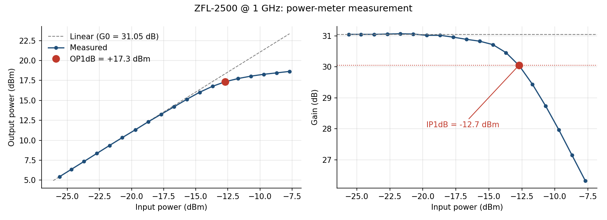
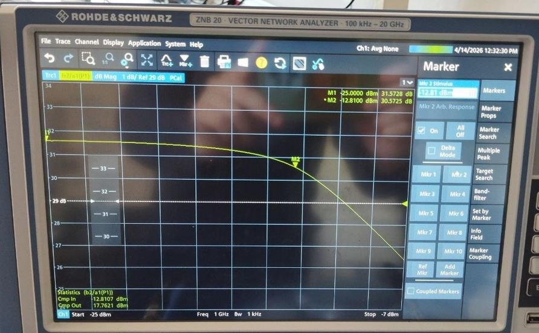
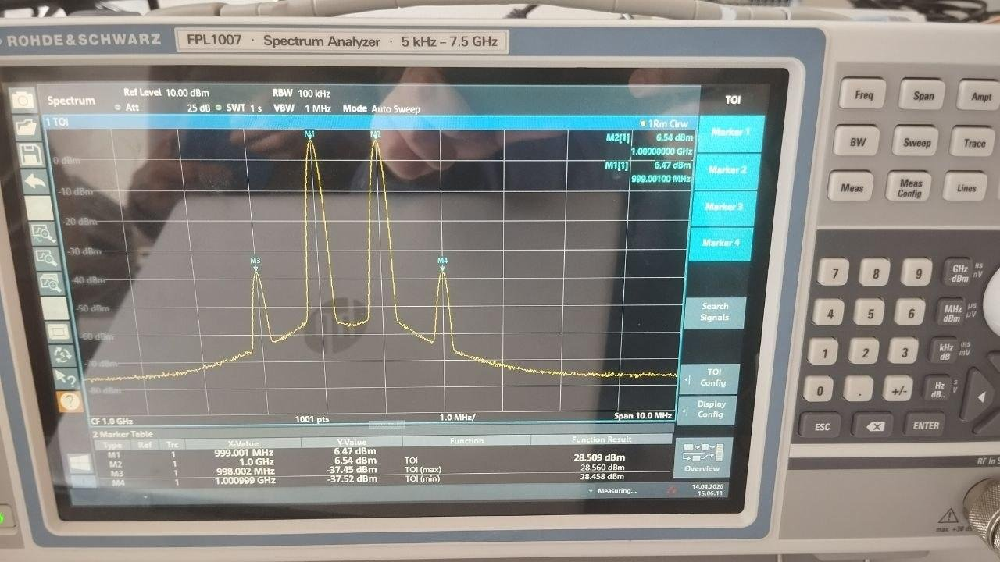

# 03 · Power amplifier: compression & intermodulation

**DUT:** Mini-Circuits ZFL-2500 gain block (0.5–2.5 GHz), biased at 5 V, measured at 1 GHz.

**Goal:** measure its 1 dB compression point (power meter and VNA) and its intermodulation products (spectrum analyzer), then compare with the manufacturer's datasheet.

**Instruments:** HP 437B power meter, R&S ZNB20 VNA with NRP18S power sensor, R&S FPL1007 spectrum analyzer.

## Results

| | Power meter | VNA | Datasheet (typ., 5 V, 1 GHz) |
|---|---|---|---|
| Small-signal gain | 31.05 dB | 31.57 dB | 32.1 dB |
| **Output P1dB** | **+17.3 dBm** | **+17.8 dBm** | +17.5 dBm |
| Input P1dB | −12.7 dBm | −12.8 dBm | — |

Two-tone test at −25 dBm per tone (output +6.5 dBm per tone):

| Product | Level | Below carrier | Output intercept |
|---|---|---|---|
| **IM3** (998 / 1001 MHz) | −37.4 dBm | 43.9 dBc | **OIP3 = +28.5 dBm** (datasheet +27 typ.) |
| IM2 (1999 MHz) | −24.8 dBm | 31.4 dBc | OIP2 = +37.9 dBm |
| H2 (1998 / 2000 MHz) | −32.3 dBm | 38.8 dBc | OIP_H2 = +45.4 dBm |



*Power-meter sweep, plotted from the [raw data](data/compression_powermeter_1GHz.csv) with [`scripts/plot_compression.py`](scripts/plot_compression.py).*

## Methods

1. **Power meter:** zeroed and calibrated the 8481D sensor (with its correction factor at 1 GHz) behind two 30 dB protection pads. Swept the input from −25 to −7 dBm in 1 dB steps.
2. **VNA power sweep:** calibrated the receiver power with the NRP18S (reference receiver, source flatness within ±0.1 dB, then the b2 receiver) and repeated the flatness calibration with the amplifier in place. Measured b2/a1 against input power at 1 GHz and read the result from the built-in compression-point function.
3. **Two-tone test:** combined f1 = 999 MHz and f2 = 1000 MHz (combiner and cable losses ≈ 5 dB) into the amplifier, with 25 dB of input attenuation on the analyzer. Measured IM3 around 1 GHz and IM2/H2 around 2 GHz.



*VNA power sweep at 1 GHz. The compression-point readout gives −12.81 dBm in and +17.76 dBm out.*



*Two-tone spectrum. The analyzer's built-in TOI function gives +28.51 dBm, matching the hand calculation.*

## Sanity checks

- **The methods agree.** Power meter and VNA differ by about 0.5 dB on gain (0.52 dB) and 0.4 dB on P1dB, and both are close to the datasheet.
- **OIP3 − OP1dB = 11 dB,** within the usual 10–12 dB rule of thumb for a class-A gain block.
- **OIP_H2 − OIP2 = 7.5 dB,** close to the 6 dB theory predicts: a second-order product is 6 dB stronger in two-tone (f1+f2) than in single-tone (2f).
- **Limitation:** the intercept points come from a single input level, 12 dB below compression. A sweep over several input levels, checking the 3:1 slope, would make them more reliable.
- **Reference values.** Gain (32.08 dB) and output P1dB (+17.53 dBm) come from the typical-performance table of the Mini-Circuits ZFL-2500 datasheet at 5 V and 1 GHz. The +27 dBm OIP3 is the single typical figure in the specification table, with no frequency stated, so the +1.5 dB difference with my measurement is not a strict comparison.

## Reproduce

```bash
pip install -r ../requirements.txt
python scripts/plot_compression.py
```

The script reads `data/compression_powermeter_1GHz.csv`, computes G0 and the 1 dB point by interpolation, and redraws the figure.
